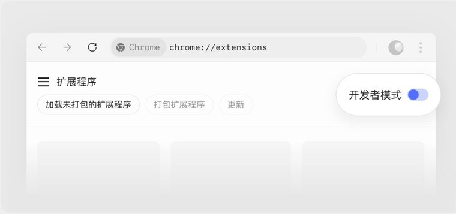
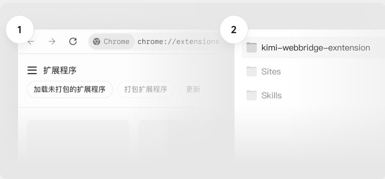
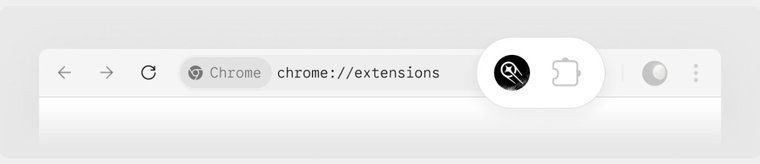
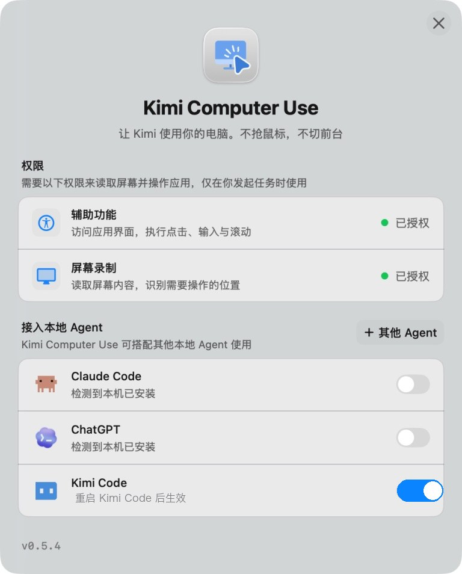

# Plugins

Plugins 把可复用的 Kimi Code CLI 能力打包成可安装单元——可以添加 [Agent Skills](./skills.md)、自定义 [Agent](./agents.md)、在会话启动时自动加载指定 Skill、提供系统提示词指令，也可以声明 MCP servers 来提供真实工具能力。适合把工作流共享给团队、连接外部服务，或从[官方插件](#官方插件)安装扩展。

## 安装与管理

在 TUI 中运行 `/plugins` 打开 plugin 管理器。它是一个面板，有四个 tab：

- **Installed**：管理已装的
- **Official**：Kimi 官方 marketplace plugin
- **Curated**：默认 marketplace 中来自 Kimi 合作伙伴的第三方 plugin
- **Custom**：从 URL 安装

用 `Tab` / `Shift-Tab` 切换。常用按键：

| 按键 | 操作 |
| --- | --- |
| `Tab` / `Shift-Tab` | 在 Installed / Official / Curated / Custom 四个 tab 间切换 |
| `Space` | 启用或禁用选中的已安装 plugin（Installed tab） |
| `D` | 移除选中的已安装 plugin（Installed tab） |
| `M` | 管理选中 plugin 的 MCP servers（Installed tab） |
| `R` | 重新加载 `installed.json` 和所有 manifest（Installed tab） |
| `Enter` | Installed tab：有更新时安装更新，否则查看 plugin 详情 · Official/Curated tab：安装或更新 · Custom tab：安装 |
| `I` | 查看 plugin 详情（Installed tab） |
| `Esc` | 返回或取消 |

也可以直接使用斜杠命令：

| 命令 | 说明 |
| --- | --- |
| `/plugins` | 打开交互式 plugin 管理器 |
| `/plugins list` | 列出已安装 plugins |
| `/plugins install <path-or-url>` | 从本地目录、zip URL 或 GitHub 仓库 URL 安装 |
| `/plugins marketplace [source]` | 浏览官方 marketplace，或传入自定义 marketplace JSON 的路径或 URL |
| `/plugins info <id>` | 查看 plugin 详情和 diagnostics |
| `/plugins enable <id>` | 启用 plugin |
| `/plugins disable <id>` | 禁用 plugin |
| `/plugins remove <id>` | 移除 plugin（需二次确认） |
| `/plugins reload` | 重载 `installed.json` 和各 plugin manifest |
| `/plugins mcp enable <id> <server>` | 启用 plugin 声明的 MCP server |
| `/plugins mcp disable <id> <server>` | 禁用 plugin 声明的 MCP server |

### 从 GitHub 安装

通过 `/plugins install <url>` 可以直接从 GitHub 仓库安装，支持四种 URL 形式：

- `https://github.com/<owner>/<repo>`：安装最新 release；无 release 时回落到默认分支
- `https://github.com/<owner>/<repo>/tree/<ref>`：安装指定分支、tag 或短 commit SHA
- `https://github.com/<owner>/<repo>/releases/tag/<tag>`：钉死具体 tag
- `https://github.com/<owner>/<repo>/commit/<sha>`：钉死具体 commit

网络请求只走 `github.com` 重定向和 `codeload.github.com` 下载，不调用 `api.github.com`。

### 注意事项

- Plugin 变更需要通过 `/reload` 或新会话生效。安装、启用/禁用、移除后，运行 `/reload` 或 `/new`；当前会话不会更新。
- 本地安装会被拷贝到 `$KIMI_CODE_HOME/plugins/managed/<id>/`，CLI 始终从这份托管副本运行。安装后编辑原始源目录不会生效，需重新安装。
- 移除 plugin 只会删除安装记录，托管副本和原始源文件仍保留在磁盘上。
- Plugin 目前按用户安装，对所有项目生效，暂不支持项目级安装范围。

### 自定义 marketplace JSON

浏览自定义目录时，把 JSON 路径或 URL 传给 `/plugins marketplace <source>`；或通过 [`KIMI_CODE_PLUGIN_MARKETPLACE_URL`](../configuration/env-vars.md) 覆盖默认 marketplace。`plugins` 数组中每个条目需要 `id` 和 `source`（本地路径、zip URL 或 GitHub URL）：

```json
{
  "version": "2",
  "plugins": [
    {
      "id": "my-plugin",
      "displayName": "My Plugin",
      "source": "./my-plugin"
    }
  ]
}
```

## 官方插件

官方插件是 Kimi 官方维护的 plugin 和内置产品能力，目前有以下三种：

- **[Kimi Datasource](#kimi-datasource)**：用自然语言查询金融行情、宏观经济、企业工商、学术文献和法律法规
- **[Kimi WebBridge](#kimi-webbridge)**：让 AI 直接操控你自己的浏览器，完成各类网页操作
- **[Kimi Computer Use](#kimi-computer-use)**：让 AI 操作你的桌面应用（macOS 和 Windows）

### 安装与升级

官方插件的安装与升级流程一致：

1. 运行 `/plugins`，tab键选择 **Official**
2. 找到要安装的插件，按 `Enter` 安装
3. 安装完成后运行 `/reload` 或 `/new` 激活

::: info 说明
Kimi WebBridge 分两步安装：完成上述步骤后，还需要[安装浏览器扩展](#install-the-browser-extension)才能使用。
:::

官方插件更新后会在使用旧版时提示更新，不会自动更新，要升级到新版本，重复上述安装步骤即可。

### Kimi Datasource <Badge type="tip" text="v3.3.0" />

Kimi Datasource 是 Kimi Code 官方数据插件，让你用自然语言直接查询金融行情、宏观经济、企业工商、学术文献和中国法律法规，无需手动调用接口或申请数据账号。

使用前需先通过 `/login` 完成 Kimi Code 账号 OAuth 登录，数据查询会消耗你的 Kimi Code 套餐额度。

#### 使用方式

1. 直接用自然语言描述你的需求，Kimi Code 会自动调用数据能力
2. 通过 `/skill:kimi-datasource` 明确触发数据查询 Skill

#### 能做什么

**实时量化研究**：盯着茅台想做个量化分析？一句话拉取近三年的每日收盘价、MACD 和 KDJ 信号，直接出结论，不用找第三方数据平台。

**跨国宏观对比**：研究中印越产业转移？基于世界银行 50 年历史数据，一次查询拿到三国 GDP 增速、贸易额、人口结构的完整时间序列对比。

**合同前风险排查**：签合同前五分钟才想起来要查对方背景？输入公司名，立刻拿到工商注册信息、股权穿透、司法纠纷和失信记录，当场决策。

**文献综述加速**：写论文要梳理 RLHF 领域的研究脉络？直接列出高引论文、主要作者和核心结论，综述提纲半小时内成型。

**法律条文速查**：碰上居住权的合同纠纷，拿不准法条？一句话定位《民法典》相关条文原文、效力级别和时效性，再顺手拉几个相近判例佐证，不用翻法规库。

**机构级美股研究**：写美股深度报告？一句话拉出年报原文、标准化财务指标、前 50 大股东和分析师一致预期，不用在多个数据终端之间来回切。

#### 数据覆盖

| 类别 | 覆盖范围 |
|---|---|
| 股票与金融市场 | Wind、S&P Capital IQ、SEC EDGAR 等知名数据库，能力涵盖 A 股、港股、美股等主要市场的行情、技术指标、财报估值、分析师预期，以及 8,000+ 美股上市公司的官方披露文件 |
| 宏观经济 | 世界银行、IMF 等知名数据库，能力涵盖全球 189 个国家 50 年以上的时间序列：GDP、贸易、人口、汇率、CPI、国际收支、GDP 预测等 |
| 企业数据 | 中国大陆境内企业工商信息、股权穿透、司法风险、关联图谱 |
| 学术文献 | 物理、数学、计算机、金融、经济等领域百万量级论文，支持预印本查询 |
| 法律法规 | 中国法律法规与司法案例：各效力层次的法规检索与详情，普通及权威判例检索 |
| 智能筛选 | 恒生聚源等知名数据库，能力涵盖自然语言选股、选基金、选基金经理，以及宏观行业数据、研报、公告与新闻 |

#### 计费与限制

- 数据查询按次计费，消耗 Kimi Code 账号额度
- 插件为只读查询，不提供任何写入或交易功能
- 技术指标（MACD、KDJ 等）及实时行情仅在交易时段内可用
- AI 输出内容仅供参考，不构成任何投资或商业决策建议

### Kimi WebBridge <Badge type="tip" text="v1.11.3" />

Kimi WebBridge 让 AI 直接操控你的浏览器，带着你的登录状态和 Cookie，AI 可以像你一样打开网页、阅读内容、点击按钮、填写表单、截图保存，把重复繁琐的网页操作交给它完成。产品介绍见 [Kimi WebBridge 官网](https://www.kimi.com/zh-cn/features/webbridge)。

<a id="install-the-browser-extension"></a>

#### 安装浏览器扩展

通过 `/plugins` 安装后，还需要在浏览器中安装 Kimi WebBridge 扩展，AI 才能操控你的浏览器。有两种安装方式：

**方式一：应用商店安装（推荐）**

打开 [Chrome 应用商店](https://chromewebstore.google.com/detail/kimi-webbridge/fldmhceldgbpfpkbgopacenieobmligc)或 [Edge 应用商店](https://microsoftedge.microsoft.com/addons/detail/kimi-webbridge/bnlffdbcfnanfbknnlaflhlhkocccckg)，点击添加即可。

**方式二：手动安装**

无法访问应用商店时使用这种方式，按以下步骤操作：

1. [下载扩展安装包](https://kimi-web-img.moonshot.cn/webbridge/latest/extension/kimi-webbridge-extension.zip)并解压
2. 在浏览器地址栏输入 `chrome://extensions/` 打开扩展管理页，开启右上角的**开发者模式**

   

3. 点击左上角的**加载未打包的扩展程序**，选择解压后的 `kimi-webbridge-extension` 文件夹

   

4. 装好后，浏览器工具栏会出现 Kimi WebBridge 图标，看到图标即安装成功，之后就可以让 AI 帮你操作网页了。

   

#### 能做什么

- **网页操作自动化**：你说话，AI 帮你点网页、填表单、读内容、截图，重复性的网页操作交给它就好
- **社媒热点选题**：自动浏览 X（Twitter）、微博、小红书的热门话题，筛选你感兴趣的方向，逐个打开高赞内容截图、提取核心观点，整理成素材库并给出选题建议
- **求职信息搜集**：在招聘网站按条件筛选岗位（关键词、城市、岗位类型），把岗位名称、链接、公司、薪资、投递方式整理成表格
- **竞品分析**：自动在多个 AI 产品间批量发问并采集回答，生成横向对比报告
- **机票比价**：在多个旅行平台查询同一行程，按价格排序记录航司、起降时间和原始链接，给出推荐方案

### Kimi Computer Use <Badge type="tip" text="v0.5.4" />

Kimi Computer Use 让 AI 直接操作你的桌面应用，可以完成点击、拖拽、滚动、输入等操作。macOS 版全程在后台静默运行，不抢占你的鼠标（少量弹窗操作仍会唤起前台 App）；Windows 版的差异见[下文注意事项](#windows-版注意事项)。

#### 授权（macOS）

安装后首次使用时，Kimi Computer Use 会弹出授权窗口，按照提示操作即可：

1. 点击**辅助功能**和**屏幕录制**右侧的**去授权**，在系统设置中开启这两项权限。前者用于执行点击、输入与滚动，后者用于读取屏幕内容、识别需要操作的位置
2. 在**接入本地 Agent**中打开 **Kimi Code** 开关，重启 Kimi Code 后生效

<div style="max-width: 380px; margin: 0 auto;">



</div>

#### Windows 版注意事项


- **会短暂占用键鼠**：Windows 版无法像 macOS 版那样稳定地全程后台输入，执行操作时可能短暂激活目标窗口并使用你的鼠标键盘
- **系统要求**：Windows 10 version 1903（Build 18362）或更新版本 / Windows 11，x64；需要真实交互式桌面会话，Windows Server 需要 Desktop Experience
- **无需额外授权**：Windows 不需要 macOS 那样的**辅助功能**和**屏幕录制**权限
- **权限对等**：目标应用以管理员权限运行时，KimiCU 也需要以同等权限运行

#### 能做什么

- **在桌面软件整理和录入信息**：让 AI 把散落在各处的信息整理进备忘录、表格或笔记软件，不用手动逐条输入
- **测试网站和应用流程**：将重复的测试步骤交给AI，截图确认渲染和跳转是否正常
- **处理重复操作**：反复打开、复制、粘贴、检查类型的工作，让AI在后台静默完成，不抢占鼠标
- **搞定没有接口的软件**：操作没有 CLI 或 API 的桌面端应用，例如让它把剪映里这段视频的片头剪掉三秒再导出

::: warning 注意
涉及资金、账号和对外发布的操作不建议使用此能力。
:::

## Plugin manifest

Plugin 是一个带 manifest 的目录或 zip 文件。Manifest 可以放在以下任一位置：

```text
<plugin_root>/kimi.plugin.json
<plugin_root>/.kimi-plugin/plugin.json
```

两个文件同时存在时，以 `kimi.plugin.json` 为准。

示例：

```json
{
  "name": "kimi-finance",
  "version": "1.0.0",
  "description": "Finance data and analysis workflows for Kimi Code CLI",
  "skills": "./skills/",
  "systemPromptPath": "./SYSTEM.md",
  "sessionStart": {
    "skill": "using-finance"
  },
  "interface": {
    "displayName": "Kimi Finance",
    "shortDescription": "Market data and financial analysis workflows"
  }
}
```

支持的字段：

| 字段 | 说明 |
| --- | --- |
| `name` | 必填，作为 plugin id。必须匹配 `[a-z0-9][a-z0-9_-]{0,63}` |
| `version`、`description`、`keywords`、`author`、`homepage`、`license` | 展示元数据 |
| `interface` | 在 `/plugins` 中展示的字段：`displayName`、`shortDescription`、`longDescription`、`developerName`、`websiteURL` |
| `skills` | 一个或多个 `./` 路径，必须位于 plugin 根目录内。省略时根目录的 `SKILL.md` 被当作单个 Skill root |
| `agents` | 一个或多个 `./` 路径，必须位于 plugin 根目录内，指向含有 [Agent 文件](./agents.md#自定义-agent)的目录。省略时根下的 `agents/` 目录（若存在）被自动采用 |
| `sessionStart.skill` | 在新会话或恢复会话开始时，把指定 plugin Skill 加载到 main agent |
| `skillInstructions` | 每次加载此 plugin 的 Skill 时一并附带的额外说明 |
| `systemPrompt` | plugin 启用期间提供给 Agent 系统提示词的内联指令 |
| `systemPromptPath` | 指向 UTF-8 文本文件的 `./` 路径；同时设置 `systemPrompt` 时，文件内容拼接在内联指令之后 |
| `mcpServers` | MCP server 声明，默认启用，可从 `/plugins` 中禁用 |
| `hooks` | 在 plugin 启用期间于生命周期事件上运行的 hook 规则；见[插件中的 Hooks](#插件中的-hooks) |
| `commands` | 一个或多个 `./` 路径，指向目录或 `.md` 文件，把其中的 Markdown 文件注册为斜杠命令；见[插件斜杠命令](#插件斜杠命令) |

`tools`、`apps`、`inject`、`configFile` 等不支持的运行时字段会显示为 diagnostics 并被忽略。

### 系统提示词指令

短指令可以直接写在 `systemPrompt`，较长内容则用 `systemPromptPath` 指向 plugin 根目录内的文件。两个字段同时存在时，内联文本在前，文件内容在后。文件内容在安装或重载 plugin 时读取，因此修改文件后需要 `/plugins reload` 才会生效。例如：

```json
{
  "name": "code-review",
  "systemPromptPath": "./SYSTEM.md"
}
```

系统提示词贡献在两个 Agent 引擎上都生效。交互式 TUI、`kimi -p` 和 `kimi web` 默认使用 v2 引擎；设置 `KIMI_CODE_LEGACY_FLAG=1` 后，本地 CLI 界面会改用旧版引擎。

`systemPrompt` 字段与 `systemPromptPath` 文件各限制为 32 KB（UTF-8 字节）：超限内容会被忽略，并显示在 plugin 的 diagnostics 中。一次提示词构建最多注入所有已启用 plugin 合计 64 KB 的指令；超出预算的贡献会被跳过并给出警告——单个 plugin 的内联文本与文件合计超过该预算时同样整体跳过。

新会话和新建 Agent 会读取当前已启用 plugin 的指令。正在进行的请求会继续使用已有的系统提示词。`/plugins reload` 会刷新 plugin Skill 列表，并请求重建活跃 Agent 的提示词；如果需要让变更在下一轮前明确收敛，请使用这个命令。在 v2 引擎中，安装、启用、禁用或移除 plugin 会立即更新 catalog，后续的提示词重建（例如压缩上下文或修改工具策略后）可能会读取新的指令。legacy 引擎会让每个活跃 session 保留自己的 plugin 快照，直到 `/plugins reload` 或创建新 session。从磁盘恢复的 session 会先使用持久化的提示词，后续重建再遵循对应引擎的行为。切换 plugin 的 MCP server 不会改变系统提示词指令。

内置 Agent 提示词会自动包含已启用 plugin 的指令。自定义 `SYSTEM.md` 或 Agent 文件完全拥有自己的模板，因此应在希望出现 plugin 指令的位置加入 `${plugin_sections}`。如果自定义模板包含 `${base_prompt}`，且该有效默认提示词已经包含 plugin 块，就不要再重复加入 `${plugin_sections}`。完整变量表见 [自定义 Agent 与 SYSTEM.md](./agents.md#用-system-md-覆盖-main-agent-的系统提示词)。

## 插件斜杠命令

斜杠命令把一段常用提示词存成 `/命令`，输入它就能触发，省得每次重打。

下面是一个最小完整例子，插件目录结构：

```text
kimi-finance/
  kimi.plugin.json
  commands/
    report.md
```

manifest（`kimi.plugin.json`）用 `commands` 字段指出命令文件的位置：

```json
{
  "name": "kimi-finance",
  "version": "1.0.0",
  "commands": "./commands/"
}
```

命令文件 `commands/report.md`。顶部两行 `---` 之间是 frontmatter（描述命令的元数据），下面的正文是触发时发给 Agent 的提示词：

```markdown
---
description: 拉取指定股票的财报并总结
---

拉取 $ARGUMENTS 的最新财报数据，总结营收、利润和关键风险。
```

装好并启用后，在对话里输入：

```text
/kimi-finance:report TSLA
```

Kimi 会把正文里的 `$ARGUMENTS` 替换成 `TSLA`，再执行这段提示词。三处细节分述如下。

### 声明命令（`commands` 字段）

`commands` 填一个 `./` 路径或路径数组，指向 plugin 根目录内的目录或 `.md` 文件：

- 指向**目录**：递归收集其中所有 `.md` 文件，每个各成为一个命令。
- 指向**单个 `.md` 文件**：只注册这一个。
- 指向非 `.md` 或不存在的路径：显示为 diagnostics（`/plugins` 面板里的诊断提示）并被忽略。

### 编写命令文件

命令文件分两部分：可选的 **frontmatter**（顶部两行 `---` 之间的元数据，可写 `name`、`description`）和**正文**（`---` 之后的提示词）。两个字段省略时的回退规则：

- `name`（命令名）：省略时用文件相对 `commands` 路径的路径命名（去 `.md`、`/` 分隔），如 `commands/frontend/component.md` → `frontend/component`；frontmatter 里显式写的优先。
- `description`（命令列表里的说明）：省略时取正文首行非空文字（超 240 字符截断）；正文也为空则显示 `No description provided.`。

### 调用命令与传参

命令自动以插件 id 作前缀（即命名空间），注册成 `<插件名>:<命令名>`，所以上面的命令实际叫 `/kimi-finance:report`，不同插件的同名命令因此不会冲突。

命令后输入的文字会替换正文里的 `$ARGUMENTS`（上例中 `TSLA` 替换掉 `$ARGUMENTS`）。若正文没写 `$ARGUMENTS` 却传了参数，参数不会丢弃，而是以 `ARGUMENTS: <你输入的内容>` 追加到正文末尾。

## Skills 与会话启动

Plugin Skills 使用与普通 [Agent Skills](./skills.md) 相同的 `SKILL.md` 格式，典型目录结构如下：

```text
my-plugin/
  kimi.plugin.json
  skills/
    using-my-plugin/
      SKILL.md
    another-workflow/
      SKILL.md
```

`sessionStart.skill` 在会话启动时把一个 plugin Skill 加载到 main agent，适合放置初始化说明、工作流规则，或把其他工具中的术语映射到 Kimi Code CLI。它只注入文本，不执行代码。

无论 Skill 通过哪种方式加载（`sessionStart.skill`、`/skill:<name>` 或模型自动调用），`skillInstructions` 都会随该 plugin 的 Skill 一起出现。

## 插件 Agent

Plugin 可以携带自定义 Agent：在 manifest 的 `agents` 字段里声明一个或多个 `./` 目录（或直接在 plugin 根下放置 `agents/` 目录），其中的 Agent 文件与[自定义 Agent](./agents.md#自定义-agent) 格式相同，会在 plugin 启用期间作为 subagent 被 main agent 自动发现和委派。

```text
my-plugin/
  kimi.plugin.json
  agents/
    reviewer.md
```

Plugin Agent 的优先级低于其他文件来源：同名时用户级、额外目录、项目级和 `--agent-file` 的 Agent 都会覆盖 plugin 提供的版本；替换内置 Agent 同样需要在 frontmatter 里显式写 `override: true`。安装、启用、禁用或移除 plugin 后，Agent 列表在新会话（或 `/reload`）时刷新；v2 引擎的当前会话还会在 `/plugins reload` 后刷新。

## Plugin 中的 MCP servers

当 plugin 需要真实工具能力时，可以在 manifest 中声明 `mcpServers`，复用 [MCP](./mcp.md) 的 schema。

Stdio server（本地命令）：

```json
{
  "mcpServers": {
    "finance": {
      "command": "uvx",
      "args": ["kimi-finance-mcp"]
    }
  }
}
```

HTTP server（远程服务）：

```json
{
  "mcpServers": {
    "docs": {
      "url": "https://example.com/mcp"
    }
  }
}
```

对于 stdio servers，`command` 可以是 `PATH` 上的命令，也可以是 plugin 根目录内以 `./` 开头的路径。`cwd` 同理，必须以 `./` 开头并位于 plugin 根目录内，否则该 server 会被忽略。

Plugin MCP servers 会在 `/reload` 后或新会话中启动。启用或禁用某个 server：

```sh
/plugins mcp disable kimi-finance finance
/reload

/plugins mcp enable kimi-finance finance
/reload
```

## 插件中的 Hooks

plugin 可以在其 manifest 中声明 hook 规则，在 plugin 启用期间于生命周期事件上运行。每一项使用与 [`config.toml` 中的 `[[hooks]]` 规则](./hooks.md#配置)相同的字段（`event`、`matcher`、`command`、`timeout`）：

```json
{
  "hooks": [
    {
      "event": "PreToolUse",
      "matcher": "Bash",
      "command": "node ./hooks/check-bash.mjs",
      "timeout": 5
    }
  ]
}
```

plugin hooks 复用与全局 hooks 相同的机制——事件列表、stdin JSON 载荷以及退出码和返回值如何影响主流程，详见 [Hooks](./hooks.md)。区别如下：

- plugin 的 hooks 仅在 plugin **启用**期间生效；禁用 plugin 后其 hooks 停止运行。
- 每条 hook 的工作目录为 plugin 根目录，因此 `command` 可以使用 plugin 内的 `./` 路径。
- hook 进程会额外收到两个环境变量：`KIMI_CODE_HOME` 和 `KIMI_PLUGIN_ROOT`（plugin 根目录）。

仅安装 plugin 本身不会运行其 hooks——它们只在 plugin 启用期间、匹配的事件触发时运行。

## 安全模型

Plugin 的加载范围有限，以下操作不会在安装或会话启动时发生：

- 不会执行命令型 plugin tools 或旧式工具运行时
- 所有路径在解析符号链接后仍必须位于 plugin 根目录内
- 已启用 plugin 的 MCP servers 会在 `/reload` 后或新会话中启动，且可随时从 `/plugins` 禁用
- 损坏的 manifest 或不安全路径会显示在 `/plugins info <id>` 的 diagnostics 中，不影响其他会话
